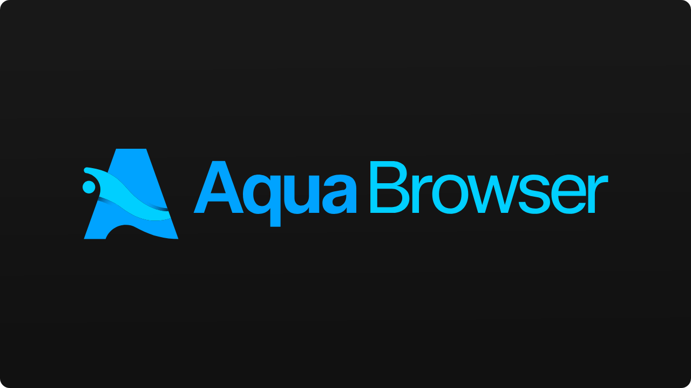

<p align="center">
  
</p>

<p align="center">
  <a href="https://github.com/aquabrowser/aqua/releases/latest">Download</a> ·
  <a href="docs/security.md">Security</a> ·
  <a href="docs/architecture.md">Architecture</a> ·
  <a href="https://github.com/aquabrowser/aqua/issues">Issues</a>
</p>

Aqua is a Windows browser built on Electron 44 (Chromium 152). Cookies, history, bookmarks, open
tabs and settings are stored in one SQLite file, each record sealed with AES-256-GCM. The key is
unwrapped with your master password (Argon2id, 128 MiB, 4 passes). Pages run in memory-only
sessions, so Chromium writes no cookie database or site storage to disk. Ads and trackers are
blocked with uBlock Origin's filter lists.

## Download

From [Releases](https://github.com/aquabrowser/aqua/releases/latest):

| File                        | Description                                                                |
| --------------------------- | -------------------------------------------------------------------------- |
| `Aqua-Browser-Setup.exe`    | Per-user installer. Profile in `%APPDATA%\aqua-browser`.                   |
| `Aqua-Browser-Portable.zip` | Portable folder. Profile in `Aqua Browser\AquaData`.                       |
| `Aqua-Browser-Portable.exe` | Single-file portable. Unpacks itself on every launch, so it starts slower. |

Windows, x64. Tested on Windows 11.

## Features

- **Encrypted vault.** `aqua.db`, sealed record by record. No recovery key and no server: a
  forgotten master password means the data stays locked.
- **In-memory browsing.** Cookies and first-party localStorage are saved into the vault and
  restored at unlock. Other site data lasts for the session.
- **Auto-lock** after an idle time you choose, and when Windows locks or sleeps. Locking zeroes
  the key.
- **Content blocking.** The Ghostery adblocker engine with uBlock Origin's default lists, in every
  window. Pause it per site from the toolbar shield.
- **Tracking protection.** Tracking parameters stripped from links and redirects; WebRTC limited
  to the default route; pop-ups without a click blocked; clipboard and passkey requests need a
  user gesture.
- **Private windows**, each in its own in-memory partition, cleared on close.
- **Updates** from GitHub Releases for installed copies: downloaded in the background, installed
  when Aqua exits or with Settings → About → Restart to update. Portable copies are replaced by hand.
- **No telemetry.** On its own, Aqua contacts only filter list mirrors (every four days), GitHub
  for updates (installed copies), the sites whose icons it shows, and a New Tab picture's address
  once when you set one. See [security.md](docs/security.md).

## Building

Requires Windows and [Node.js](https://nodejs.org/) 24.

```bash
npm install
npm run dev
```

| Command                        | Description                                                     |
| ------------------------------ | --------------------------------------------------------------- |
| `npm run dev`                  | Run with hot reload for the UI                                  |
| `npm run build`                | Production bundles in `out/`                                    |
| `npm start`                    | Run the production bundles                                      |
| `npm test`                     | Unit tests                                                      |
| `npm run typecheck`            | Type-check main/preload and renderer                            |
| `npm run format`               | Format with Prettier (`format:check` to check only)             |
| `npm run dist`                 | Installer and portable `.exe` in `dist/`                        |
| `npm run dist:portable`        | `dist/Aqua-Browser-Portable.exe`                                |
| `npm run dist:portable-folder` | `dist/Aqua Browser/` and `dist/Aqua-Browser-Portable.zip`       |
| `npm run fetch:filters`        | Refresh the bundled filter lists in `resources/filters/`        |
| `npm run icon`                 | Rebuild `build/icon.ico` and `icon.png` from `resources/brand/` |

`AQUA_USER_DATA_DIR=<folder>` runs Aqua with a separate profile. `AQUA_TRACE_STARTUP=1` prints
start-up timings. After changing `resources/brand/logo.svg` or `logo-small.svg`, run
`npm run icon` so the `.exe`, taskbar and installer icons match.

### Releasing

Set the version in `package.json`, commit, and push a matching tag:

```bash
git tag v1.0.1
```

```bash
git push origin v1.0.1
```

The [Release Build](.github/workflows/release.yml) workflow type-checks, runs the tests, builds
the installer and the portable `.exe`, and uploads them with `latest.yml` and the `.blockmap` to a
draft release. Installed copies see the release once it is published. They read releases without
a token, so updates reach users only while the repository is public.
The portable folder (`Aqua-Browser-Portable.zip`) comes from `npm run dist:portable-folder` and is
attached to the release by hand.

## Known limitations

- Locking zeroes the vault key, so changes made while Aqua is locked (cookies set by open pages,
  tab changes) are written at the next unlock. If Aqua quits while locked, those changes are lost.
- Only cookies and first-party localStorage survive a restart. IndexedDB, Cache Storage and
  service workers last for the session: sites that keep a login there (WhatsApp Web, Telegram
  Web) ask again after a restart.
- Partitioned cookies (CHIPS) are not saved and are lost on restart.
- A crash loses cookie changes from the last ~1.5 s and localStorage changes from the last ~5 s.
- With an HTTP or SOCKS proxy (not a VPN), WebRTC calls bypass it unless Settings → Privacy →
  "Calls only through a proxy" is on. That mode breaks voice in Discord and similar services,
  which need direct UDP.
- Tracking parameters are not stripped from navigations a page starts with script
  (`location.href = …`): re-issuing one could turn a form POST into a GET.
- Compared with uBlock Origin: no element picker, logger or dynamic filtering, no `$popup`
  filters, no procedural cosmetic filters (`:has-text()`, `:upward()` …) and no HTML filtering
  (`##^`).
- The single-file portable build unpacks itself to `%TEMP%` on every launch (about 10 s) and its
  launcher is a 32-bit process. The portable folder build starts in under a second.

Design decisions with side effects are listed in [architecture.md](docs/architecture.md#design-decisions).

## License

[GPL-3.0](LICENSE).

Aqua uses [Electron](https://www.electronjs.org/) (MIT), the
[Ghostery adblocker](https://github.com/ghostery/adblocker) (MPL-2.0) and filter lists from
[uBlock Origin](https://github.com/uBlockOrigin/uAssets) (GPL-3.0),
[EasyList](https://easylist.to/) (GPL-3.0 / CC BY-SA 3.0),
[Peter Lowe's list](https://pgl.yoyo.org/adservers/) and the
[Online Malicious URL Blocklist](https://gitlab.com/malware-filter/urlhaus-filter). Each list's
licence is stated in its header in `resources/filters/`.
